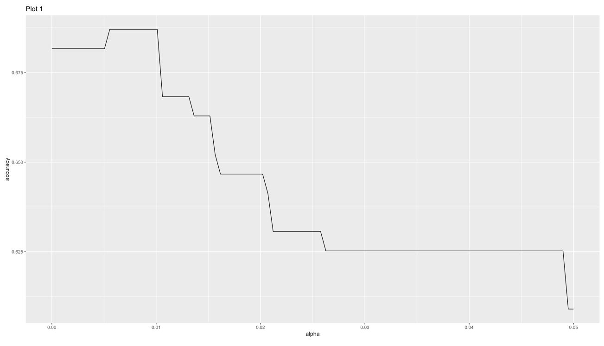
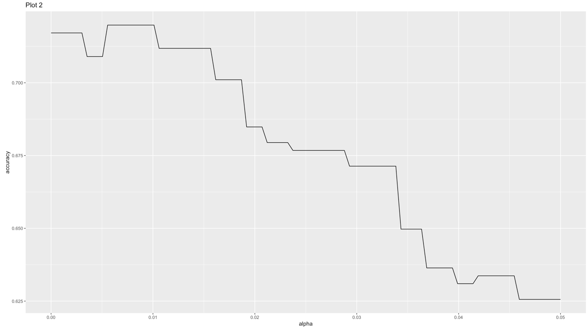
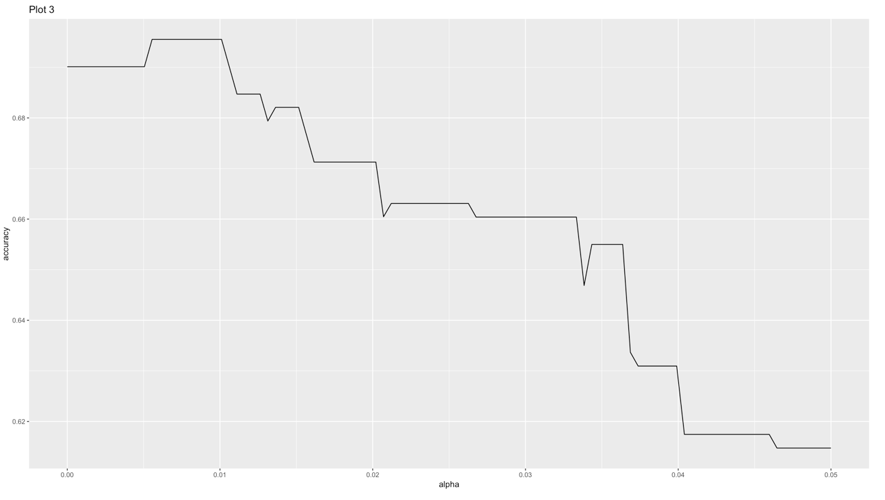

```{r setup, include=FALSE}
# Load all your packages here:
library(tidyverse)
library(GGally)
library(rpart)
library(yardstick)

# Set default behavior for all code chunks here:
knitr::opts_chunk$set(
  echo = TRUE, warning = FALSE, message = FALSE,
  fig.width = 16/2, fig.height = 9/2
)

# Set seed value of random number generator here. This is in order to get
# "replicable" randomness, so that any results based on random sampling or
# resampling are replicable everytime you knit this file. Why use a seed value
# of 76? For no other reason than 76 is one of my favorite numbers:
# https://www.youtube.com/watch?v=xjJ7FheCkCU
set.seed(76)
```

You will be fitting CART models to the data from the [Ghouls, Goblins, and Ghosts... Boo!](https://www.kaggle.com/c/ghouls-goblins-and-ghosts-boo/){target="_blank"} Kaggle competition. The competition's score for leaderboard purposes is the "Categorization Accuracy". However you will **NOT** be making any submissions to Kaggle.


***


# Load data

Read in data provided by Kaggle for this competition. They are organized in the `data/` folder of this RStudio project:

```{r}
training <- read_csv("data/train.csv")
test <- read_csv("data/test.csv")
sample_submission <- read_csv("data/sample_submission.csv")
```


## Look at your data!

Always, ALWAYS, **ALWAYS** start by looking at your raw data. This gives you visual sense of what information you have to help build your predictive models. To get a full description of each variable, read the data dictionary in the `data_description.txt` file in the `data/` folder.

Note that the following code chunk has `eval = FALSE` meaning "don't evaluate this chunk with knitting" because `.Rmd` files won't knit if they include a `View()`:

```{r, eval = FALSE}
View(training)
glimpse(training)

View(test)
glimpse(test)
```

In particular, pay close attention to the variables and variable types in the
`sample_submission.csv`. Your submission must match this exactly.

```{r}
glimpse(sample_submission)
```


***


# Minimally viable product

Perform the following exploratory data analyses:

## Univariate explorations

**Categorical predictor**: Create a visualization of the categorical predictor variable `color`.

```{r}
ggplot(data=training,aes(x=color, fill=color))+
  geom_bar(color="grey1",show.legend = FALSE)+
  labs(title="Distributuion of the categorical predictor variable", x="Dominant Color of the Creature") +
  scale_fill_manual(values=c("grey1", "darkred", "blue","snow2","lawngreen","ghostwhite"))
```


**Outcome variable**: Create a visualization of the categorical outcome variable `type`.

```{r}
ggplot(data=training,aes(x=type))+
  geom_bar()+
  labs(title="Distributuion of the categorical outcome variable", x="Creature Type")
```


## Mutlivariate explorations

**Numerical predictors**: Create a visualization of the relationship of all four numerical predictor variables at once (`bone_length`, `rotting_flesh`, `hair_length`, `has_soul`) using the `ggpairs()` function from the `GGally` [package](http://ggobi.github.io/ggally/#ggallyggpairs). 

```{r}
ggpairs(training, columns = c("bone_length", "rotting_flesh", "hair_length","has_soul"), columnLabels = c("Avg bone length", "% of rotting flesh", "Avg hair length","% of soul"))+
  labs(title = "Relationship between all four numerical predictor variables")


```

**Relationship of categorical predictor and outcome variable**: Create a visualization of the relationship between the categorical outcome variable `type` and any predictor varible of your choosing.

```{r}
ggplot(training, aes(x = color, fill = type)) +
  geom_bar(position = "fill") +
  labs(fill = "Types of creature", title = "Distribution of color of creature split by creature type", y="Proportion") 
```


***


# Due diligence

1. Fit a CART where:
    * You use only the numerical predictors.
    * The maximum depth of the tree is 5.
    * You use the default "complexity parameter" 
1. Plot the tree.
1. Make predictions `type_hat` on the `training` data. Hint compare the output of `predict(model_CART, type = "prob")` and `predict(model_CART, type = "class")`.
1. Compute the "classification accuracy".

```{r, fig.height = 9, fig.width=16}

# Fit CART model using only numerical predictors, in this case for classification
model_formula_1 <- as.formula(type ~ bone_length + rotting_flesh + hair_length + has_soul)
tree_parameters_1 <- rpart.control(maxdepth = 5)
model_CART_1 <- rpart(model_formula_1, data = training, control = tree_parameters_1)

# Plot CART model
{plot(model_CART_1, margin=0.25)
text(model_CART_1, use.n = TRUE)

title("Predicting type of creature using bone length,% of rotting flesh, hair length, & % of soul")
box()}
```


```{r}
# Make predictions on training
#Get fitted ys, where highest probability wins and ties are broken at random
type_hat_class <- model_CART_1 %>%
  predict(type = "class", newdata = training)

# Save predictions in training data frame
training <- training %>%
      mutate(type_hat = type_hat_class)  

#Compute "classification accuracy"
CA<-training %>%
  mutate(type_hat = training$type_hat,
         true = ifelse(type_hat==type, 1, 0))%>%
  summarise(CA=mean(true==1))

CA
```


***


# Reaching for the stars

Note that the $\alpha$ complexity parameter is the `cp` argument to `rpart.control()`.

1. Reusing the MP1 solutions code, for the range of `alpha` complexity parameters in the `alpha_df` data frame, return an estimate of the accuracy/error that Kaggle would return.
1. Plot the relationship between the alpha complexity parameter and accuracy.
1. Using the optimal $\alpha^*$ complexity parameter, write a `submission.csv` suitable for submission to Kaggle.


```{r}
set.seed(77)

training <- training %>% 
  sample_frac(1) %>% 
  mutate(fold = rep(1:5, length = n())) %>% 
  arrange(fold)

alpha_df <- tibble(
  alpha = seq(from = 0, to = 0.05, length = 100),
  accuracy = 0
)

for(i in 1:nrow(alpha_df)){
  alpha <- alpha_df$alpha[i]
  
  CA <- rep(0, 5)
  for(j in 1:5){
    pretend_training <- training %>% 
      filter(fold != j)
    pretend_test <- training %>% 
      filter(fold == j)
    
    # Fit model on pretend training
    model_1 <- as.formula(type ~ bone_length + rotting_flesh + hair_length + has_soul)
    tree_parameters <- rpart.control(maxdepth = 5, cp = alpha)
    model_CART <- rpart(model_1, data = pretend_training, control = tree_parameters)
    
    # Make predictions on pretend_test
    predicted_pretend_test <- model_CART %>%
      predict(type = "class", newdata = pretend_test)
    
     # Save predictions in pretend_test data frame
    pretend_test<-pretend_test%>%
      mutate(y_hat = predicted_pretend_test)

    #Compute "classification accuracy" for each fold
    CA[j] <- pretend_test %>%
      mutate(truth=ifelse(type==y_hat, 1, 0))%>%
      summarise(CA = mean(truth==1))%>%
      pull(CA)
  }
  
  # Compute average "classification accuracy""
  alpha_df$accuracy[i] <- mean(CA)
}
```


#Visualization
```{r}
ggplot(alpha_df, aes(x = alpha, y = accuracy)) +
  geom_line()
```


###Get optimal alpha
```{r}

rearr_alpha_df <- alpha_df%>%
  #arrange accuracy in descending order, with the maximum value at the top
  arrange(desc(accuracy))%>%
  #the first/ topmost row of alpha_df after rearrangement
  head(1)

# Display maximum value for accuracy and its corresponding alpha value
rearr_alpha_df
```

###**Note:**
Something is going wrong with our set.seed, so every time we run the CV we get a different classification accuracy and alpha value. However, after plotting the resulting alpha vs acccuracy plots below from multiple tries of the code, we still found that the alpha level corresponding to the maximum accuracy was approximately .0056 every time. Therefore, we set $\alpha^*$ = .0056. 

**Optimal alpha level** = 0.0055555556

The **estimated classification accuracy** is **0.6955315** when **$\alpha^*$** is **0.0055555556**.


Plot1

Plot2


Plot3


```{r}
optimal_model <- as.formula(type ~ bone_length + rotting_flesh + hair_length + has_soul)
tree_parameters <- rpart.control(maxdepth = 5, cp = .0056)
model_CART_optimal <- rpart(optimal_model, data = training, control = tree_parameters)
    
predicted_points_optimal <- model_CART_optimal %>%
    predict(type = "class", newdata = test)

#Save predictions in test data frame
    test<-test%>%
      mutate(type_hat = predicted_points_optimal)
    
#Submission data frame
    submission <- test %>%
      select(id,type_hat)

write_csv(submission, path = "data/submission.csv")
```
 

***


# Point of diminishing returns

* Use one-hot-enconding to fit a predictive CART model using the categorical variable `color` and plot the tree. Set the maximum depth of the tree to 5 and use the default "complexity parameter".
* No need to generate an estimate of the accuracy that Kaggle would return. 


```{r}
# One-hot encoding for the color variable
training<-training%>%
  mutate(black = ifelse(color == "black", 1, 0),
         blood = ifelse(color == "blood", 1, 0),
         blue = ifelse(color == "blue", 1, 0),
         clear = ifelse(color == "clear", 1, 0),
         white = ifelse(color == "white", 1, 0))

# Fit CART model, in this case for classification
model_formula_2 <- as.formula(type ~ black+blue+blood+clear+white)
model_CART_2 <- rpart(model_formula_2, data = training, control = tree_parameters_1)

# Plot CART model
{plot(model_CART_2, margin=0.25)
text(model_CART_2, use.n = TRUE)

title("Predicting type of creature using the categorical variable, color")
box()}
```